# 🌿 WellSpace – A Website for Well-being and Mental Health 💙

🚀 **Developed by:** Nilangi Edirisinghe and Team 
🏫 **Institution:** The University of Adelaide, South Australia  
🎓 **Degree:** Master of Computing and Innovation  
👥 **Team:** 22-N  

---

## 📝 Overview  

WellSpace is a comprehensive **mental health support platform** that integrates **peer support, professional counseling, and educational content** to make mental health resources more **accessible, engaging, and supportive**.

This platform offers:  
✅ A **blog with interactive discussions** 📝  
✅ **Informational content** on mental health 📚  
✅ **Counseling services** with booking functionality 🩺  
✅ **Engaging quizzes and challenges** to enhance self-awareness 🎯  
✅ **Volunteer & donation options** to support the community ❤️  

---

## 🎯 Project Aims  

1️⃣ **Provide universal and accessible mental health support** 🌍  
2️⃣ **Foster a supportive community** through discussions and interactions 🗣️  
3️⃣ **Enhance user engagement** via interactive quizzes and challenges 🤹  
4️⃣ **Offer booking services** for professional counseling 🗓️  
5️⃣ **Ensure privacy and credibility** for all users 🔐  

---

## 🏗️ Technology Stack  

### 🎨 Frontend (Developed by Nilangi Edirisinghe)  
- **React.js** ⚛️  
- **CSS & Bootstrap** 🎨  
- **React Context API** for state management 🧩  
- **React Quill** for rich text editing 🖊️  
- **Cloudinary API** for image uploads 🖼️  

### 🔧 Backend (Developed by Team Members)  
- **Node.js + Express.js** 🏗️  
- **MongoDB (Cloud-hosted)** 💾  
- **Mongoose for database schema management** 📊  
- **RESTful APIs with Axios** 🔄  

### 🔐 User Authentication  
- JWT-based authentication 🔑  
- **Private routes & session management** 🚪  

---

## 📜 Features  

🔹 **Home Page** – Engaging landing page with navigation & user testimonials 🏠  
🔹 **Blog & Discussion Forum** – Experts create articles, users comment and engage 📝  
🔹 **Counselor Booking System** – Secure online consultation appointments 📅  
🔹 **Challenges & Quizzes** – Self-assessment tools for mental well-being 🎭  
🔹 **Volunteer & Donation Pages** – Supporting community-driven mental health initiatives 🤝  
🔹 **User Authentication System** – Secure sign-up and login system 🔐  
🔹 **State Management** – Seamless user experience across the platform 🔄  

---

## 🚀 My Contributions  

🎨 **Front-end Development:**  
- Designed and implemented the **majority of web pages** 🖥️  
- Styled pages using **CSS & Bootstrap** 🎨  
- Integrated **state management** using React Context API 🔄  
- Developed **private routes** for user authentication 🔐  

📝 **Blog & Discussion System:**  
- Created **all front-end pages** for the blog ✍️  
- Integrated blog features with backend using **REST APIs** 🌐  
- Implemented **comments & replies system** 💬  

🔐 **User Authentication System:**  
- Designed and implemented **signup & login functionalities** 🚪  
- Managed **session-based state management** for authentication 🔑  

🔗 **Integration with Backend:**  
- Worked closely with the backend team to integrate APIs 🤝  
- Ensured seamless **frontend-backend communication** via Axios 📡  

---

## 🏆 Project Achievements  

✅ Successfully developed and deployed all **front-end pages** 🎨  
✅ Fully integrated **blog system** (frontend & backend) 📝  
✅ Implemented **user authentication** with secure access 🔑  
✅ Completed **booking system** for online counseling 🩺  
✅ Developed and tested **API endpoints & database models** 🛠️  
✅ Conducted **manual testing** (unit, integration, and usability) ✔️  

---

## 🙌 Acknowledgments  

💡 **A collaborative effort with peers under the guidance of:**  
👩‍🏫 **Supervisor:** Dr. Diana Shah, The University of Adelaide.
📚 **Course Coordinator:** Dr. Cruz Izu, The University of Adelaide.  
🛠️ **Back-End Web Development Team Leader:** Li-Ting Liao (now a Software Engineer at Telstra)  

🌟 *Special thanks to my team members for their contributions to backend development and database management!*  

---

## 💡 Future Enhancements  

🚀 **Administrative Dashboard** – For monitoring & managing users/admins 🛠️  
🚀 **Enhanced Privacy & Security** – Strengthening data protection 🔐  
🚀 **AI-Driven Personalized Suggestions** – Tailoring resources for users 🤖  
🚀 **Mobile Application** – Expanding accessibility 📱  
🚀 **Search Engine Optimization (SEO)** – Improving online visibility 🔍  

---

## 📩 Contact  

🔗 **Developed by:** Nilangi Edirisinghe and Team
📧 **Email:** nilangi.ediri@gmail.com  
🏫 **University:** The University of Adelaide  

🌟 *Together, we can create a safer and healthier space for mental well-being!* 🌟  

## 📸 Screenshots  

Here are some screenshots showcasing WellSpace’s user interface:  

### 🏠 Home Page  
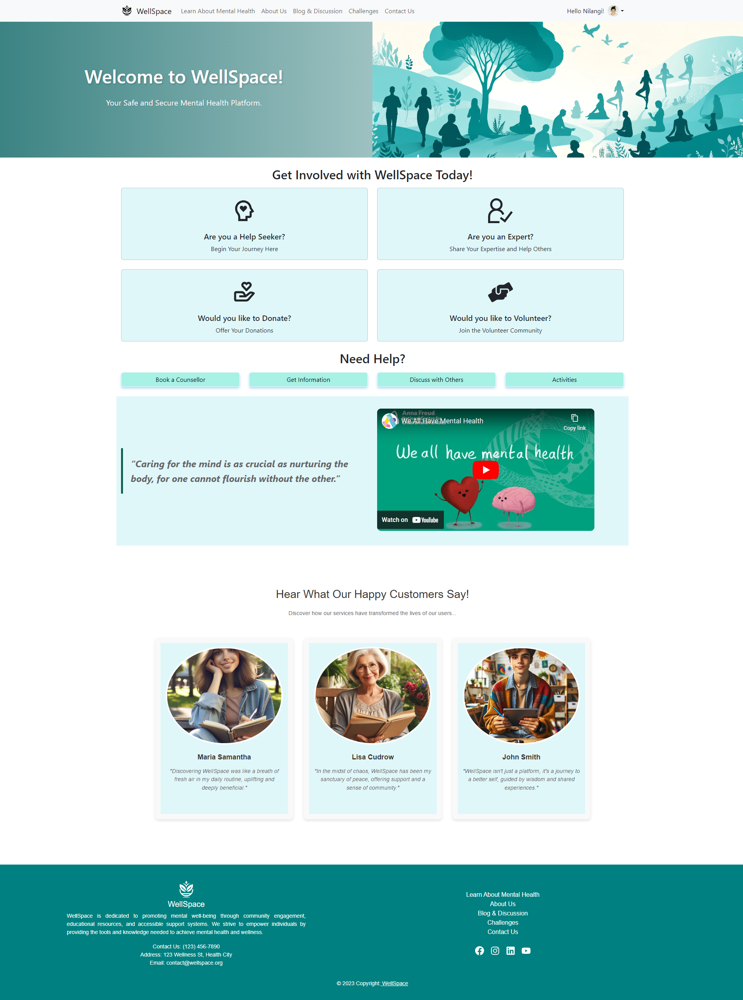  

### 📝 Blog Section  
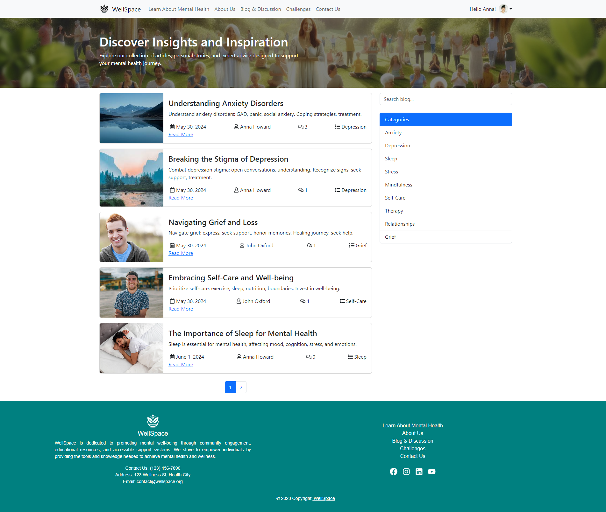  

### 📖 Individual Blog Post  
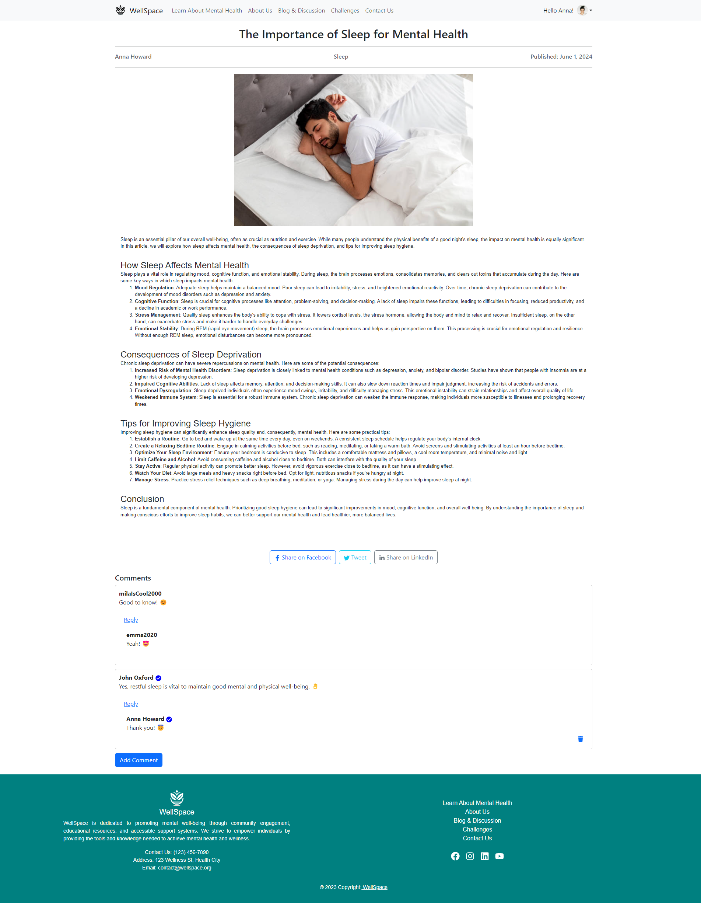  

### ℹ️ Information Page  
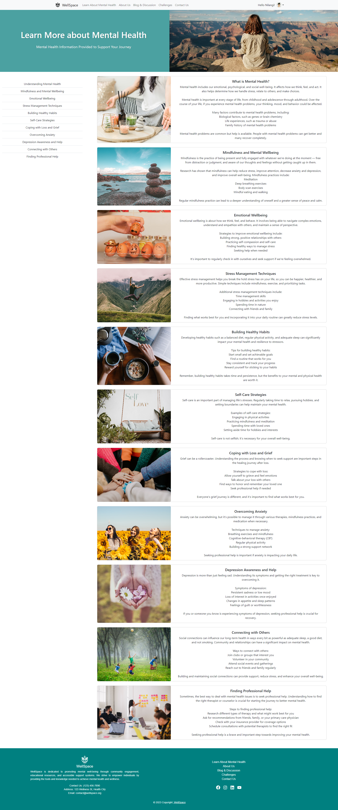  

### ✍️ Create Blog Page (For Experts)  
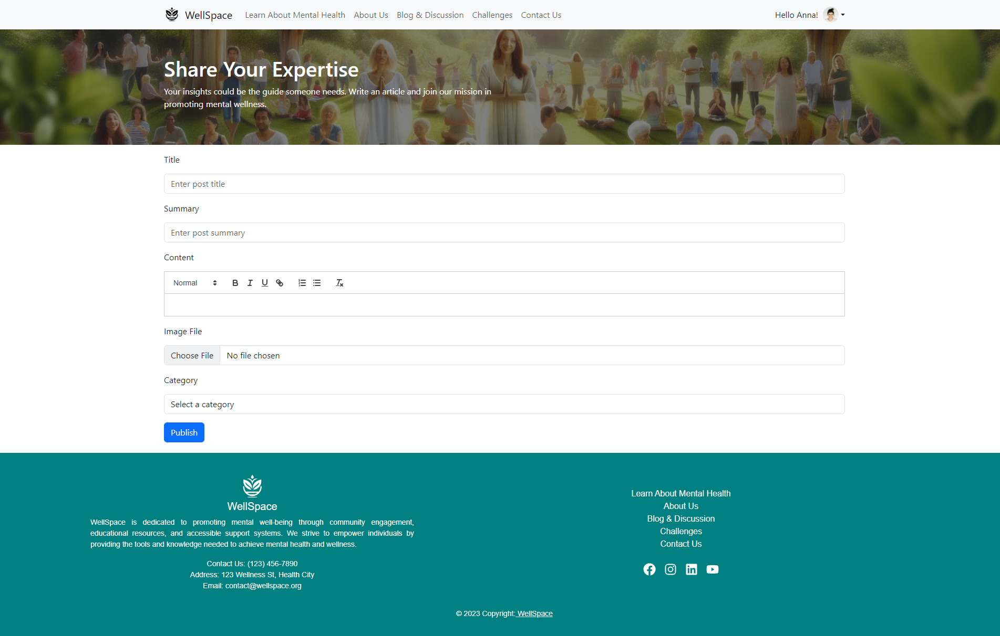  

### 📜 My Blogs Page (For Experts)  
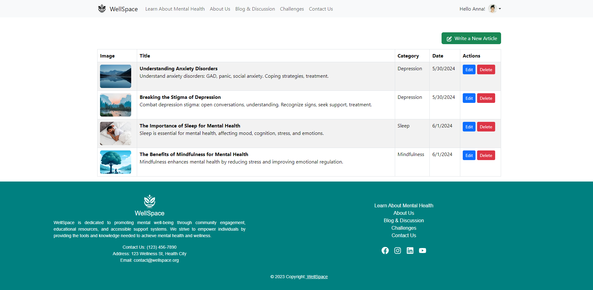  

### ✏️ Edit Blog Page (For Experts)  
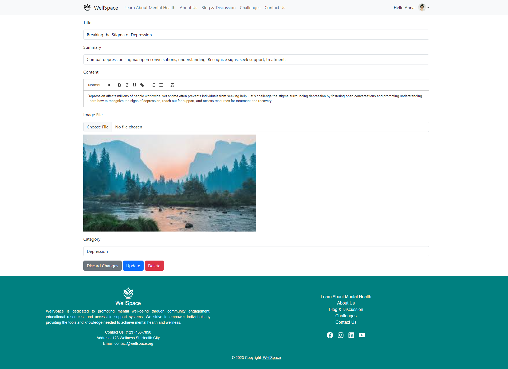  

### 🎯 Challenges Page  
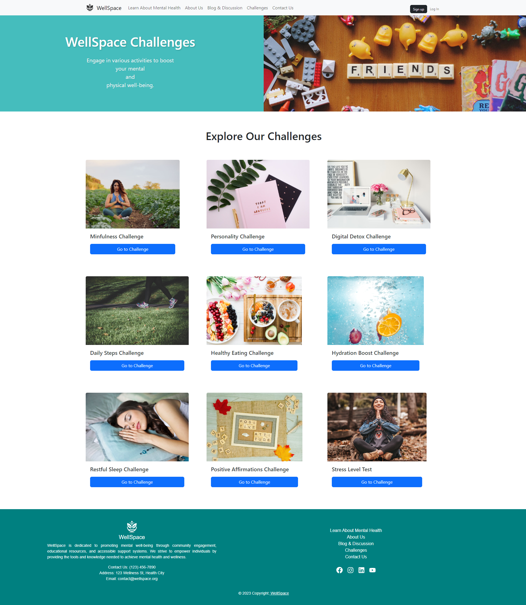  

### 📞 Contact Us Page  
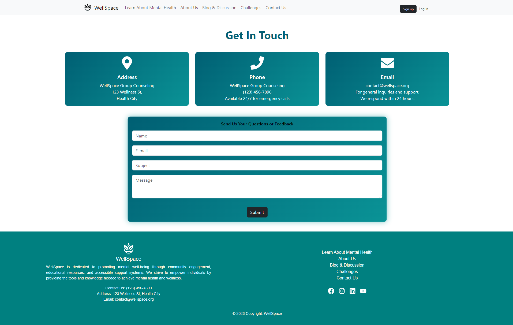  

### 🧘 Mindfulness Quiz Page  
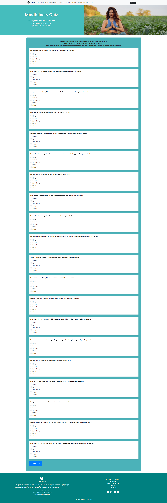  

### 💙 Volunteer Page  
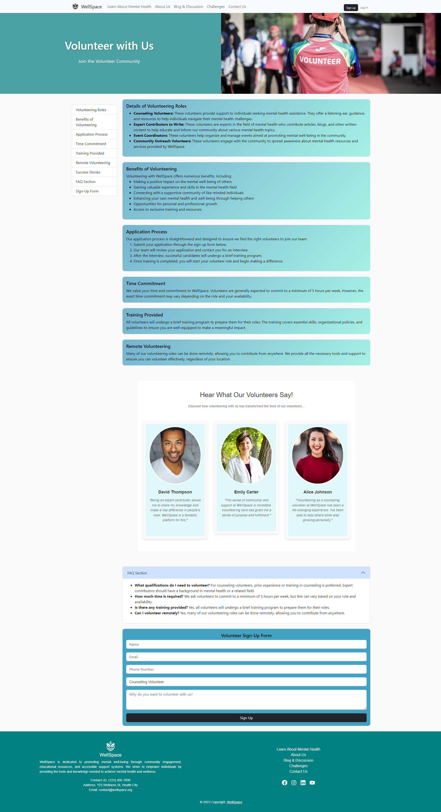  

